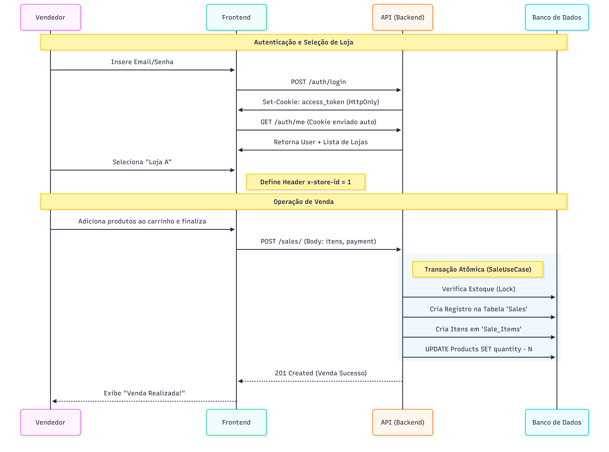
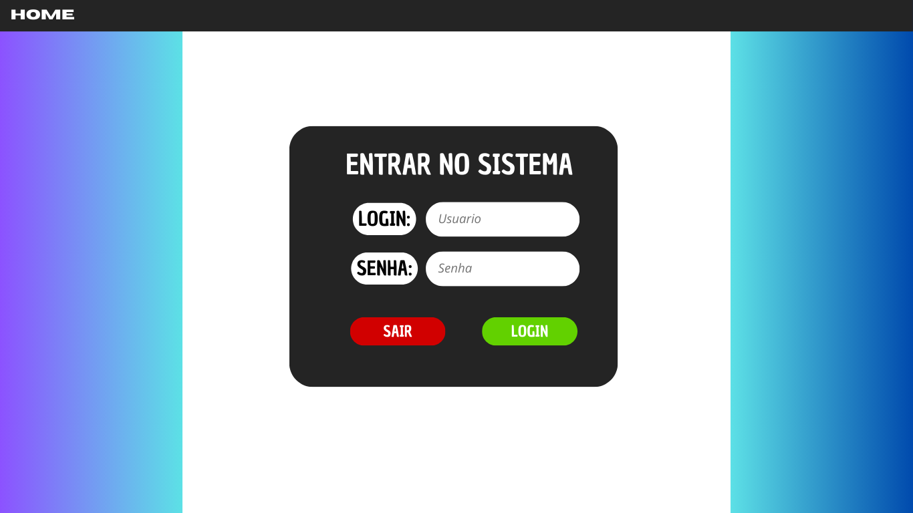
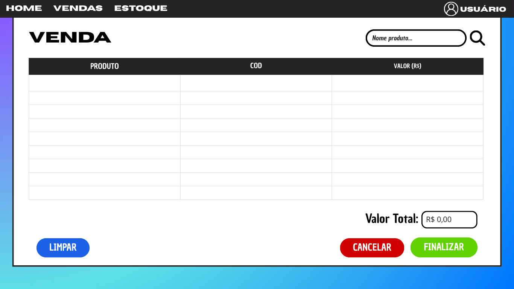

# Sistema de Controle de Vendas e Estoque

## 1) Problema
Pequenos e médios comerciantes frequentemente enfrentam dificuldades para controlar seu estoque e vendas de maneira organizada. Muitos ainda utilizam planilhas manuais ou anotações, o que gera inconsistências, perda de informações e falta de visibilidade sobre a saúde do negócio.  

Um sistema digital simples e acessível pode reduzir erros, melhorar a gestão do inventário e ajudar a tomar decisões mais assertivas sobre compras, promoções e fluxo de caixa.

---

## 2) Atores e Decisores
- **Usuários finais**: vendedores, atendentes e gestores de loja que utilizam o sistema diariamente para registrar vendas e atualizar o estoque.  
- **Decisores**: proprietários e gerentes, responsáveis por escolher a solução tecnológica e acompanhar relatórios de desempenho.

---

## 3) Casos de uso (de forma simples)
<!-- Formato "Ator: ações que pode fazer". -->

- **Vendedor/Atendente**: registrar vendas, consultar produtos disponíveis no estoque.  
- **Gestor de Estoque**: cadastrar novos produtos, editar informações de produtos, remover produtos, visualizar estoque baixo.  
- **Proprietário/Gerente**: acompanhar relatórios de vendas, analisar produtos mais vendidos, verificar movimentação de estoque.

---

## 4) Limites e Suposições (+ Plano B)
- O sistema será inicialmente **monousuário** e voltado para **lojas físicas pequenas**.  
- O banco de dados inicial será **SQLite** para simplicidade, podendo ser trocado por **PostgreSQL/MySQL** em cenários maiores.  
- Supondo que o usuário possua acesso a computador e internet para usar a aplicação.  
- **Plano B**: caso a aplicação web não seja viável em determinado contexto, poderá ser utilizada apenas localmente como aplicação desktop simplificada.

---

## 5) Hipóteses (valor e viabilidade) e Validação
- **Hipótese de valor**: comerciantes que atualmente usam planilhas terão ganhos de eficiência e menos erros ao migrar para este sistema.  
- **Hipótese de viabilidade**: é possível construir um MVP funcional utilizando **Python (FastAPI)** no backend e **React + Vite** no frontend em um prazo curto.  
- **Validação**: feedback com usuários reais de pequenas lojas, testes de uso em ambiente real e comparação com processos manuais.

---

## 6) Fluxo principal do usuário e primeira fatia vertical
### **1\. Fluxo Curto: Rotina de Venda (Vendedor)**

Este fluxo representa o "Caminho Feliz" do dia a dia: o vendedor chega, loga e realiza uma venda rápida.

**Passo a Passo:**

1. **Login:** O vendedor acessa a tela de login e insere credenciais.  
2. **Contexto:** O sistema retorna os dados do usuário e as lojas permitidas (`/auth/me`). O vendedor seleciona a loja ativa (caso tenha mais de uma).  
3. **Venda:** O vendedor seleciona os produtos e finaliza a venda.  
4. **Processamento:** O sistema valida o estoque, registra a venda e baixa o estoque numa única transação.

 

### **2\. Fluxo Longo: Configuração e Ciclo Completo (Admin/Gerente)**

Este fluxo cobre desde a criação da infraestrutura (Loja/Produto) até a realização da venda. É ideal para testar a integração de todos os CRUDs.

**Passo a Passo:**

#### **1\. Acesso e Contexto**

1. **Login:** O vendedor insere email/senha. A API autentica e grava um **Cookie HttpOnly** seguro no navegador.  
2. **Carregamento:** O sistema identifica o usuário e lista as lojas permitidas.  
3. **Seleção de Loja:** O vendedor escolhe a loja de trabalho (ex: "Matriz"). O sistema passa a enviar o cabeçalho x-store-id automaticamente.

#### **2\. Carrinho e Validação**

4. **Consulta de Produto:** Ao adicionar um item, o sistema consulta o banco para validar se o preço está correto e se há estoque disponível na loja selecionada.  
5. **Envio da Venda:** O vendedor confirma o pagamento e fecha o pedido.

#### **3\. Processamento Atômico**

6. **Transação Segura:** O banco de dados realiza três ações em conjunto:  
   * Cria o registro da venda.  
   * Registra os itens vendidos.  
   * **Deduz a quantidade do estoque** imediatamente.  
7. **Conclusão:** Se tudo der certo, a venda é confirmada e o recibo é exibido. Caso contrário, nada é alterado (Rollback).


**Primeira fatia vertical (MVP)**:  
- Cadastro de produtos  
- Registro de vendas  
- Atualização de estoque  

Com esse núcleo funcional já é possível entregar valor inicial e evoluir o sistema em ciclos curtos.

---

## 7) Esboços de algumas telas (Wireframes)
Para guiar o desenvolvimento da interface, foram feitos esboços de telas principais:  

- **Tela de Login**: acesso ao sistema por usuário e senha.  
- **Tela de Vendas**: registro de novas vendas, seleção de produtos e quantidade.  
- **Tela de Estoque**: listagem de produtos, status de estoque baixo e opções de adicionar/editar/remover.  

Os wireframes estão disponíveis na pasta [`/docs/wireframes`](./docs/wireframes).  

### Exemplos:
  
  

## 8) Tecnologias

### 8.1 Navegador
**Navegador:** React + Vite (HTML/CSS/JS)  
**Armazenamento local (se usar):** LocalStorage (sessão de usuário)  
**Hospedagem:** GitHub Pages (protótipo)  

### 8.2 Front-end (servidor de aplicação, se existir)
**Front-end (servidor):** React (SPA)  
**Hospedagem:** GitHub Pages  

### 8.3 Back-end (API/servidor, se existir)
**Back-end (API):** FastAPI (Python)  
**Banco de dados:** PostgreSQL
**Deploy do back-end:** Render 

---

## 9) Plano de Dados (Dia 0) — somente itens 1–3

### **9.1 Entidades**

* **Usuario (users)** — Acesso ao sistema (Vendedor, Gerente de Estoque, Admin).  
* **Loja (stores)** — Entidade que agrupa os dados. O sistema é multi-loja.  
* **Usuario\_Loja (user\_stores)** — Tabela associativa que define permissões de acesso (quem trabalha em qual loja).  
* **Cliente (clients)** — Consumidor final cadastrado por loja.  
* **Produto (products)** — Item de estoque, isolado por loja.  
* **Venda (sales)** — Registro da transação financeira.  
* **ItemVenda (sale\_items)** — Detalhes dos produtos em uma venda.  

---

### **9.2 Campos por entidade**

#### **Usuario (users)**

| Campo | Tipo | Obrigatório | Detalhes |
| :---- | :---- | :---- | :---- |
| id | Serial (PK) | Sim | Identificador único. |
| name | Varchar(255) | Sim | Nome completo. |
| email | Varchar(255) | Sim | Único globalmente. Usado para login. |
| password\_hash | Varchar(255) | Sim | Hash seguro (bcrypt). |
| role | Enum | Sim | Valores: 'seller', 'stock\_manager', 'admin'. |
| created\_at | Timestamp | Sim | Automático. |

#### **Loja (stores)**

| Campo | Tipo | Obrigatório | Detalhes |
| :---- | :---- | :---- | :---- |
| id | Serial (PK) | Sim | Identificador da loja. |
| name | Varchar(255) | Sim | Nome fantasia. |
| cnpj | Varchar(18) | Não | Documento legal. |
| owner\_id | Integer (FK) | Não | Usuário criador/dono (referencia users.id). |

#### **Cliente (clients)**

*Nota: CPF e E-mail são únicos apenas dentro da mesma loja (Unique Composite)* 
| Campo | Tipo | Obrigatório | Detalhes | 
| :--- | :--- | :--- | :--- |
 | id | Serial (PK) | Sim | Identificador. | 
 | store\_id | Integer (FK) | **Sim** | Vínculo com a loja (RLS). | 
 | name | Varchar(100) | Sim | Nome do cliente. |
  | cpf | Varchar(11) | Não | Cadastro de pessoa física. | 
  | email | Varchar(255) | Não | Contato. |

#### **Produto (products)**

*Nota: Estoque é isolado por loja.* 

| Campo | Tipo | Obrigatório | Detalhes |
| :--- | :--- | :--- | :--- | 
| id | Serial (PK) | Sim | Identificador. | 
| store\_id | Integer (FK) | **Sim** | Vínculo com a loja (RLS). | 
| name | Varchar(100) | Sim | Nome do produto. | 
| price | Decimal(10,2) | Sim | Preço de venda atual. | 
| quantity | Integer | Sim | Saldo de estoque. | 
| category | Varchar(50) | Não | Categoria para filtros. |

#### **Venda (sales)**

| Campo | Tipo | Obrigatório | Detalhes |
| :---- | :---- | :---- | :---- |
| id | Serial (PK) | Sim | Número da venda. |
| store\_id | Integer (FK) | **Sim** | Loja onde ocorreu a venda. |
| user\_id | Integer (FK) | Sim | Vendedor responsável. |
| client\_id | Integer (FK) | Não | Cliente (opcional). |
| payment\_type | Enum | Sim | 'Money', 'Debit', 'Credit', 'PIX'. |
| total\_value | Decimal(10,2) | Sim | Valor final calculado. |

#### **ItemVenda (sale\_items)**

| Campo | Tipo | Obrigatório | Detalhes |
| :---- | :---- | :---- | :---- |
| id | Serial (PK) | Sim | Identificador do item. |
| sale\_id | Integer (FK) | Sim | Vínculo com a venda. |
| product\_id | Integer (FK) | Sim | Produto vendido. |
| quantity | Integer | Sim | Quantidade vendida. |
| unit\_price | Decimal(10,2) | Sim | Preço *no momento da venda* (Snapshot). |

---

### 9.3 Relações entre entidades

1. **Usuário \<-\> Loja (N:N):** Um usuário pode trabalhar em várias lojas, e uma loja tem vários funcionários. Resolvido pela tabela user\_stores.  
2. **Loja \-\> Dados (1:N):** Produtos, Clientes e Vendas pertencem a **uma** loja específica (store\_id). Isso permite o isolamento dos dados via RLS.  
3. **Venda \-\> Itens (1:N):** Uma venda possui vários itens. Se a venda for apagada, os itens são apagados (Cascade).  
4. **Produto \<-\> Venda (N:N):** Resolvido pela tabela sale\_items.  
5. **Venda \-\> Cliente (N:1):** Uma venda pode estar associada a um único cliente.

### 9.4 Modelagem (SQL)

A modelagem completa do banco de dados, incluindo a criação de tabelas, inserção de dados de exemplo e queries de teste, foi implementada e separada para melhor organização.

* **DDL QUERY**

```SQL
    \-- Criação de Tipos ENUM personalizados  
CREATE TYPE user\_role AS ENUM ('vendedor', 'gerente');  
CREATE TYPE payment\_type AS ENUM ('Money', 'Debit', 'Credit', 'PIX', 'Other');

\-- Tabela de Usuários do sistema  
CREATE TABLE users (  
    id SERIAL PRIMARY KEY,  
    name VARCHAR(255) NOT NULL,  
    email VARCHAR(255) NOT NULL UNIQUE,  
    password\_hash VARCHAR(255) NOT NULL,  
    role user\_role NOT NULL,  
    created\_at TIMESTAMP WITH TIME ZONE NOT NULL DEFAULT CURRENT\_TIMESTAMP,  
    updated\_at TIMESTAMP WITH TIME ZONE NOT NULL DEFAULT CURRENT\_TIMESTAMP  
);

\-- Tabela de Clientes da loja  
CREATE TABLE clients (  
    id SERIAL PRIMARY KEY,  
    name VARCHAR(100) NOT NULL,  
    surname VARCHAR(100),  
    cpf VARCHAR(11) UNIQUE,  
    number VARCHAR(20),  
    email VARCHAR(255) UNIQUE  
);

\-- Tabela de Produtos  
CREATE TABLE products (  
    id SERIAL PRIMARY KEY,  
    name VARCHAR(255) NOT NULL,  
    description TEXT,  
    price NUMERIC(10, 2\) NOT NULL CHECK(price \>= 0),  
    quantity INTEGER NOT NULL CHECK(quantity \>= 0),  
    category VARCHAR(100),  
    created\_at TIMESTAMP WITH TIME ZONE NOT NULL DEFAULT CURRENT\_TIMESTAMP,  
    updated\_at TIMESTAMP WITH TIME ZONE NOT NULL DEFAULT CURRENT\_TIMESTAMP  
);

\-- Tabela de Vendas  
CREATE TABLE sales (  
    id SERIAL PRIMARY KEY,  
    user\_id INTEGER NOT NULL REFERENCES users(id),  
    client\_id INTEGER REFERENCES clients(id),  
    payment\_type payment\_type NOT NULL,  
    total\_value NUMERIC(10, 2\) NOT NULL,  
    created\_at TIMESTAMP WITH TIME ZONE NOT NULL DEFAULT CURRENT\_TIMESTAMP  
);

\-- Tabela Associativa para os Itens de uma Venda  
CREATE TABLE sale\_items (  
    id SERIAL PRIMARY KEY,  
    sale\_id INTEGER NOT NULL REFERENCES sales(id) ON DELETE CASCADE,  
    product\_id INTEGER NOT NULL REFERENCES products(id),  
    quantity INTEGER NOT NULL,  
    unit\_price NUMERIC(10, 2\) NOT NULL  
);  
```

* **DML QUERY**
```sql
-- --- LIMPEZA DE DADOS (Opcional, para evitar duplicados) ---
TRUNCATE TABLE sale_items, sales, products, clients, user_stores, stores, users RESTART IDENTITY CASCADE;

-- 1. INSERIR UTILIZADORES
-- Senha para ambos é 'secret': $2b$12$EixZaYVK1fsbw1ZfbX3OXePaWxn96p36WQoeG6Lruj3vjPGga31lW
INSERT INTO users (name, email, password_hash, role) VALUES
('Alice Proprietária', 'alice@email.com', '$2b$12$EixZaYVK1fsbw1ZfbX3OXePaWxn96p36WQoeG6Lruj3vjPGga31lW', 'admin'),
('Bruno Vendedor', 'bruno@email.com', '$2b$12$EixZaYVK1fsbw1ZfbX3OXePaWxn96p36WQoeG6Lruj3vjPGga31lW', 'seller');

-- 2. INSERIR LOJAS
-- Alice (ID 1) é a dona de ambas as lojas
INSERT INTO stores (name, cnpj, owner_id) VALUES
('Loja Matriz - Eletrônicos', '12.345.678/0001-99', 1),
('Filial Centro - Roupas', '98.765.432/0001-11', 1);

-- 3. VINCULAR UTILIZADORES ÀS LOJAS (Tabela Associativa)
INSERT INTO user_stores (user_id, store_id) VALUES
(1, 1), -- Alice trabalha na Loja 1
(1, 2), -- Alice trabalha na Loja 2
(2, 1); -- Bruno trabalha APENAS na Loja 1

-- 4. INSERIR CLIENTES (Segregados por Loja)
INSERT INTO clients (store_id, name, surname, cpf, number, email) VALUES
-- Clientes da Loja 1 (Eletrônicos)
(1, 'Carlos Silva', 'Almeida', '11122233344', '11999990000', 'carlos@loja1.com'),
(1, 'Diana Prince', 'Amazonas', '22233344455', '11988887777', 'diana@loja1.com'),
-- Clientes da Loja 2 (Roupas) - Note que o CPF pode até repetir se fosse outra pessoa em outra loja
(2, 'Eduardo Stark', 'Winterfell', '33344455566', '21999991111', 'eduardo@loja2.com');

-- 5. INSERIR PRODUTOS (Estoque isolado por loja)
INSERT INTO products (store_id, name, description, price, quantity, category) VALUES
-- Loja 1: Eletrônicos
(1, 'Notebook Gamer', 'i7, 16GB RAM, RTX 3060', 4500.00, 10, 'Computadores'),
(1, 'Mouse Sem Fio', 'Mouse ergonômico 2.4Ghz', 150.00, 50, 'Periféricos'),
(1, 'Teclado Mecânico', 'Switch Blue RGB', 300.00, 20, 'Periféricos'),
-- Loja 2: Roupas
(2, 'Camiseta Básica', 'Algodão Pima', 49.90, 100, 'Vestuário'),
(2, 'Calça Jeans', 'Slim Fit Azul', 120.00, 40, 'Vestuário');

-- 6. INSERIR VENDAS
-- Venda 1: Feita na Loja 1, pelo Bruno (User 2), para o Carlos (Client 1)
INSERT INTO sales (store_id, user_id, client_id, payment_type, total_value) VALUES
(1, 2, 1, 'Credit', 4650.00);

-- Itens da Venda 1
INSERT INTO sale_items (sale_id, product_id, quantity, unit_price) VALUES
(1, 1, 1, 4500.00), -- 1 Notebook
(1, 2, 1, 150.00);  -- 1 Mouse

-- Venda 2: Feita na Loja 2, pela Alice (User 1), para o Eduardo (Client 3)
INSERT INTO sales (store_id, user_id, client_id, payment_type, total_value) VALUES
(2, 1, 3, 'PIX', 99.80);

-- Itens da Venda 2
INSERT INTO sale_items (sale_id, product_id, quantity, unit_price) VALUES
(2, 4, 2, 49.90); -- 2 Camisetas

```

* **DQL QUERY**

```sql
-- Query 1: Listar produtos com baixo estoque APENAS da Loja 1 (Matriz)
SELECT 
    id, name, quantity, price 
FROM 
    products 
WHERE 
    store_id = 1 
    AND quantity < 15;

-- Query 2: Relatório de Vendas consolidadas POR LOJA
-- Útil para o Admin ver qual loja está faturando mais
SELECT 
    st.name AS nome_loja,
    COUNT(s.id) AS qtd_vendas,
    SUM(s.total_value) AS faturamento_total
FROM 
    sales s
JOIN 
    stores st ON s.store_id = st.id
GROUP BY 
    st.name
ORDER BY 
    faturamento_total DESC;

-- Query 3: Ver quais usuários têm acesso a quais lojas
-- (Isso ajuda a debugar problemas de permissão)
SELECT 
    u.name AS usuario,
    u.role AS cargo,
    s.name AS loja_permitida
FROM 
    users u
JOIN 
    user_stores us ON u.id = us.user_id
JOIN 
    stores s ON us.store_id = s.id
ORDER BY 
    u.name;

-- Query 4: Detalhes de uma venda (Nota Fiscal simples)
-- Mostra: Loja, Vendedor, Cliente, Produtos e Total
SELECT 
    st.name AS loja,
    u.name AS vendedor,
    c.name AS cliente,
    p.name AS produto,
    si.quantity AS qtd,
    si.unit_price AS preco_unit,
    (si.quantity * si.unit_price) AS subtotal
FROM 
    sale_items si
JOIN sales s ON si.sale_id = s.id
JOIN products p ON si.product_id = p.id
JOIN stores st ON s.store_id = st.id
JOIN users u ON s.user_id = u.id
LEFT JOIN clients c ON s.client_id = c.id
WHERE 
    s.id = 1; -- Filtra pela Venda ID 1

```

### **9.5\. Dados de Teste e Endpoints da API**

### **Tabela de Endpoints**

#### **Autenticação (Auth)**

| Método | Rota | Descrição |
| :---- | :---- | :---- |
| POST | /auth/login | Realiza login e define cookie seguro (HttpOnly). |
| POST | /auth/logout | Realiza logout (remove cookie). |
| GET | /auth/me | Retorna dados do utilizador logado e as suas lojas. |

#### **Utilizadores (Users)**

| Método | Rota | Descrição |
| :---- | :---- | :---- |
| POST | /users/ | Cria um novo utilizador. |
| GET | /users/ | Lista todos os utilizadores (conforme RLS). |
| GET | /users/{user\_id} | Obtém detalhes de um utilizador específico. |
| GET | /users/email/{user\_email} | Obtém utilizador por e-mail. |
| PUT | /users/{user\_id} | Atualiza dados de um utilizador. |
| DELETE | /users/{user\_id} | Remove um utilizador. |

#### **Lojas (Stores)**

| Método | Rota | Descrição |
| :---- | :---- | :---- |
| POST | /stores/ | Cria uma nova loja (vínculo automático com criador). |
| GET | /stores/ | Lista lojas permitidas ao utilizador. |
| GET | /stores/{store\_id} | Obtém detalhes de uma loja. |
| GET | /stores/cnpj/{cnpj} | Obtém loja por CNPJ. |
| PUT | /stores/{store\_id} | Atualiza dados de uma loja. |
| DELETE | /stores/{store\_id} | Remove uma loja. |

#### **Clientes (Clients)**

*Requer Header x-store-id ou seleção de loja.*

| Método | Rota | Descrição |
| :---- | :---- | :---- |
| POST | /clients/ | Cadastra cliente na loja ativa. |
| GET | /clients/ | Lista clientes da loja ativa. |
| GET | /clients/{client\_id} | Obtém cliente por ID. |
| GET | /clients/email/{email} | Obtém cliente por e-mail (dentro da loja). |
| GET | /clients/cpf/{cpf} | Obtém cliente por CPF (dentro da loja). |
| PUT | /clients/{client\_id} | Atualiza cliente. |
| DELETE | /clients/{client\_id} | Remove cliente. |

#### **Produtos (Products)**

*Requer Header x-store-id ou seleção de loja.*

| Método | Rota | Descrição |
| :---- | :---- | :---- |
| POST | /products/ | Cadastra novo produto na loja. |
| GET | /products/ | Lista todos os produtos da loja. |
| GET | /products/{product\_id} | Obtém detalhes de um produto. |
| PUT | /products/{product\_id} | Atualiza produto (preço, stock, etc). |
| DELETE | /products/{product\_id} | Remove produto. |

#### **Vendas (Sales)**

*Requer Header x-store-id ou seleção de loja.*

| Método | Rota | Descrição |
| :---- | :---- | :---- |
| POST | /sales/ | Realiza venda (baixa stock atomicamente). |
| GET | /sales/ | Lista histórico de vendas da loja. |
| GET | /sales/{sale\_id} | Obtém detalhes de uma venda. |

#### 

## 

## **10\. Tecnologias Necessárias**

* **Python 3.12+**  
* **FastAPI** (Framework Web)  
* **PostgreSQL** (Banco de dados com suporte a Row Level Security)  
* **SQLAlchemy** (ORM)  
* **Pydantic** (Validação de dados)

## **11\. Como Rodar**

### **Passo a Passo**

1. Configurar Ambiente e Dependências:  
   Certifique-se de que tem um ambiente virtual (.venv) ativado e, de seguida, instale as dependências a partir da raiz do projeto.  
   python \-m venv .venv  
   \# Windows: .venv\\Scripts\\activate  
   \# Linux/Mac: source .venv/bin/activate  
   pip install \-r requirements.txt

2. Configurar Variáveis de Ambiente:  
   Copie o ficheiro .env.example para um novo ficheiro chamado .env.  
   cp .env.example .env

   Preencha com as suas credenciais e chaves de segurança.**Atenção:** Gere uma SECRET\_KEY segura (ex: openssl rand \-hex 32).  
3. Criar e Popular o Banco de Dados (PostgreSQL):  
   O sistema utiliza Row Level Security (RLS). É crucial que o utilizador do banco de dados definido no .env NÃO seja um superutilizador (como postgres), caso contrário as políticas de segurança serão ignoradas.  
   \# 1\. Crie um utilizador comum no seu banco (ex: app\_user) se ainda não existir.

   \# 2\. Execute o script de inicialização (Cria tabelas, Enums, Triggers e Policies)  
   psql \-h localhost \-U app\_user \-d store\_manager\_db \-f src/infra/db/scripts/init.sql

   \# 3\. (Opcional) Popule com dados de teste (Utilizadores, Lojas, Produtos)  
   psql \-h localhost \-U app\_user \-d store\_manager\_db \-f src/infra/db/scripts/dml.sql

### **Comandos de Execução**

* **Modo de Desenvolvimento (com auto-reload):**  
  uvicorn src.main:app \--reload \--log-level debug

* **Modo de Produção:**  
  uvicorn src.main:app \--host 0.0.0.0 \--port 8000

### **Porta Padrão**

* **8000** (Acesse a documentação em: http://localhost:8000/docs)

## **12\. Variáveis de Ambiente**

As seguintes variáveis são obrigatórias para a conexão com o banco, segurança da aplicação e configuração de CORS. Devem ser definidas no ficheiro .env.

### **Banco de Dados**

* DB\_HOST: Endereço do servidor (ex: localhost).  
* DB\_PORT: Porta do PostgreSQL (ex: 5432).  
* DB\_USER: Utilizador do banco (**Não usar root/postgres**).  
* DB\_PASSWORD: Senha do utilizador.  
* DB\_NAME: Nome do banco de dados (ex: store\_manager\_db).

### **Segurança (JWT e Cookies)**

* SECRET\_KEY: Chave hash longa e aleatória para assinar os tokens.  
* ALGORITHM: Algoritmo de criptografia (recomendado: HS256).  
* ACCESS\_TOKEN\_EXPIRE\_MINUTES: Tempo de validade do token/cookie em minutos (ex: 30).  
* COOKIE\_SECURE: Define se o cookie exige HTTPS. Use False para desenvolvimento local e True em produção.

### **CORS (Front-end)**

* ALLOWED\_ORIGINS: Lista de domínios permitidos para acessar a API, separados por vírgula.

#### **Exemplo de .env**

\# Database  
DB\_HOST=localhost  
DB\_PORT=5432  
DB\_USER=app\_user  
DB\_PASSWORD=senha\_segura  
DB\_NAME=store\_manager\_db

\# Security  
SECRET\_KEY=sua\_chave\_secreta\_gerada\_aqui  
ALGORITHM=HS256  
ACCESS\_TOKEN\_EXPIRE\_MINUTES=30  
COOKIE\_SECURE=False

\# CORS  
ALLOWED\_ORIGINS=http://localhost:5173,\[http://127.0.0.1:5173\]
