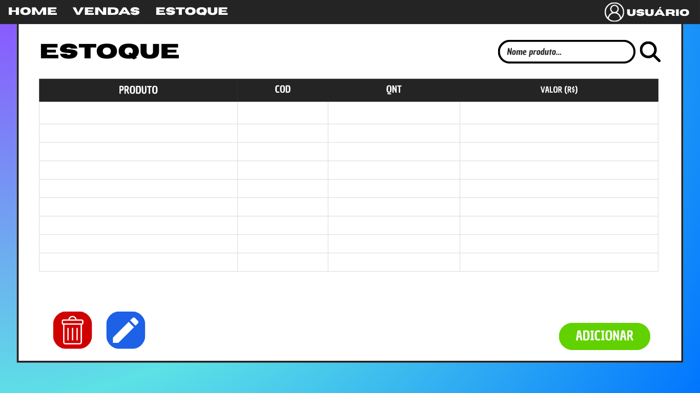

# Sistema de Controle de Vendas e Estoque

## 1) Problema
Pequenos e médios comerciantes frequentemente enfrentam dificuldades para controlar seu estoque e vendas de maneira organizada. Muitos ainda utilizam planilhas manuais ou anotações, o que gera inconsistências, perda de informações e falta de visibilidade sobre a saúde do negócio.  

Um sistema digital simples e acessível pode reduzir erros, melhorar a gestão do inventário e ajudar a tomar decisões mais assertivas sobre compras, promoções e fluxo de caixa.

---

## 2) Atores e Decisores
- **Usuários finais**: vendedores, atendentes e gestores de loja que utilizam o sistema diariamente para registrar vendas e atualizar o estoque.  
- **Decisores**: proprietários e gerentes, responsáveis por escolher a solução tecnológica e acompanhar relatórios de desempenho.

---

## 3) Casos de uso (de forma simples)
<!-- Formato "Ator: ações que pode fazer". -->

- **Vendedor/Atendente**: registrar vendas, consultar produtos disponíveis no estoque.  
- **Gestor de Estoque**: cadastrar novos produtos, editar informações de produtos, remover produtos, visualizar estoque baixo.  
- **Proprietário/Gerente**: acompanhar relatórios de vendas, analisar produtos mais vendidos, verificar movimentação de estoque.

---

## 4) Limites e Suposições (+ Plano B)
- O sistema será inicialmente **monousuário** e voltado para **lojas físicas pequenas**.  
- O banco de dados inicial será **SQLite** para simplicidade, podendo ser trocado por **PostgreSQL/MySQL** em cenários maiores.  
- Supondo que o usuário possua acesso a computador e internet para usar a aplicação.  
- **Plano B**: caso a aplicação web não seja viável em determinado contexto, poderá ser utilizada apenas localmente como aplicação desktop simplificada.

---

## 5) Hipóteses (valor e viabilidade) e Validação
- **Hipótese de valor**: comerciantes que atualmente usam planilhas terão ganhos de eficiência e menos erros ao migrar para este sistema.  
- **Hipótese de viabilidade**: é possível construir um MVP funcional utilizando **Python (FastAPI)** no backend e **React + Vite** no frontend em um prazo curto.  
- **Validação**: feedback com usuários reais de pequenas lojas, testes de uso em ambiente real e comparação com processos manuais.

---

## 6) Fluxo principal do usuário e primeira fatia vertical
**Fluxo principal do usuário**:  
1. Usuário acessa o sistema e faz login (quando houver autenticação).  
2. Cadastra produtos no estoque.  
3. Registra uma venda.  
4. O estoque é atualizado automaticamente.  
5. Usuário gera um relatório simples das vendas.  

**Primeira fatia vertical (MVP)**:  
- Cadastro de produtos  
- Registro de vendas  
- Atualização de estoque  

Com esse núcleo funcional já é possível entregar valor inicial e evoluir o sistema em ciclos curtos.

---

## 7) Esboços de algumas telas (Wireframes)
Para guiar o desenvolvimento da interface, foram feitos esboços de telas principais:  

- **Tela de Login**: acesso ao sistema por usuário e senha.  
- **Tela de Vendas**: registro de novas vendas, seleção de produtos e quantidade.  
- **Tela de Estoque**: listagem de produtos, status de estoque baixo e opções de adicionar/editar/remover.  

Os wireframes estão disponíveis na pasta [`/docs/wireframes`](./docs/wireframes).  

### Exemplos:
  
  

## 8) Tecnologias
<!-- Liste apenas o que você REALMENTE pretende usar agora. -->

### 8.1 Navegador
**Navegador:** React + Vite (HTML/CSS/JS)  
**Armazenamento local (se usar):** LocalStorage (sessão de usuário)  
**Hospedagem:** GitHub Pages (protótipo)  

### 8.2 Front-end (servidor de aplicação, se existir)
**Front-end (servidor):** React (SPA)  
**Hospedagem:** Vercel (possível)  

### 8.3 Back-end (API/servidor, se existir)
**Back-end (API):** FastAPI (Python)  
**Banco de dados:** SQLite (inicial, evolutivo para PostgreSQL)  
**Deploy do back-end:** Railway (possível)  

---

## 9) Plano de Dados (Dia 0) — somente itens 1–3
<!-- Defina só o essencial para criar o banco depois. -->

### 9.1 Entidades
- **Usuario** — pessoa que acessa o sistema (vendedor, gerente).  
- **Produto** — item disponível no estoque da loja.  
- **Venda** — registro de uma venda realizada, vinculada a produtos e usuários.  

---

### 9.2 Campos por entidade

#### Usuario
| Campo            | Tipo       | Obrigatório | Exemplo             |
|------------------|------------|-------------|---------------------|
| id               | número     | sim         | 1                   |
| nome             | texto      | sim         | "Ana Souza"         |
| email            | texto      | sim (único) | "ana@exemplo.com"   |
| senha_hash       | texto      | sim         | "$2a$10$..."        |
| papel            | número (0=vendedor, 1=gerente) | sim | 0 |
| dataCriacao      | data/hora  | sim         | 2025-08-20 14:30    |
| dataAtualizacao  | data/hora  | sim         | 2025-08-20 15:10    |

#### Produto
| Campo            | Tipo       | Obrigatório | Exemplo             |
|------------------|------------|-------------|---------------------|
| id               | número     | sim         | 101                 |
| nome             | texto      | sim         | "Camiseta Preta"    |
| preco            | número     | sim         | 49.90               |
| quantidade       | número     | sim         | 20                  |
| categoria        | texto      | não         | "Roupas"            |
| dataCriacao      | data/hora  | sim         | 2025-08-20 10:10    |
| dataAtualizacao  | data/hora  | sim         | 2025-08-20 12:30    |

#### Venda
| Campo            | Tipo       | Obrigatório | Exemplo             |
|------------------|------------|-------------|---------------------|
| id               | número     | sim         | 5001                |
| usuario_id       | número (fk)| sim         | 1                   |
| data             | data/hora  | sim         | 2025-08-20 14:40    |
| valor_total      | número     | sim         | 149.70              |

#### VendaProduto (tabela associativa para N:N)
| Campo            | Tipo       | Obrigatório | Exemplo             |
|------------------|------------|-------------|---------------------|
| id               | número     | sim         | 7001                |
| venda_id         | número (fk)| sim         | 5001                |
| produto_id       | número (fk)| sim         | 101                 |
| quantidade       | número     | sim         | 3                   |
| preco_unitario   | número     | sim         | 49.90               |

---

### 9.3 Relações entre entidades
- Um **Usuario** pode realizar muitas **Vendas** (1→N).  
- Uma **Venda** pertence a um **Usuario** (N→1).  
- Uma **Venda** pode ter muitos **Produtos** (N→N).  
- Um **Produto** pode aparecer em muitas **Vendas** (N→N).  
- A relação **VendaProduto** resolve o N:N entre **Venda** e **Produto**.  
